<svg width="860" height="200" viewBox="0 0 860 200" xmlns="http://www.w3.org/2000/svg">
  <defs>
    <style>
      @import url('https://fonts.googleapis.com/css2?family=JetBrains+Mono:wght@400;700&amp;display=swap');

      .bg { fill: #0d1117; }
      .glow-circle { fill: #58a6ff; opacity: 0.06; }

      .tag { font-family: 'JetBrains Mono', monospace; font-size: 12px; fill: #484f58; }
      .name { font-family: 'JetBrains Mono', monospace; font-size: 38px; font-weight: 700; fill: #e6edf3; }
      .name-accent { fill: #58a6ff; }
      .role { font-family: 'JetBrains Mono', monospace; font-size: 14px; fill: #7d8590; }
      .quote { font-family: 'JetBrains Mono', monospace; font-size: 12px; fill: #3fb950; }

      .dot { fill: #58a6ff; }
      .dot2 { fill: #3fb950; }
      .dot3 { fill: #bc8cff; }
      .dot4 { fill: #ffa657; }

      .line { stroke: #21262d; stroke-width: 1; }

      /* Pulse dots */
      .dot { animation: pulse-blue 2s ease-in-out infinite; }
      .dot2 { animation: pulse-green 2s ease-in-out infinite 0.5s; }
      .dot3 { animation: pulse-purple 2s ease-in-out infinite 1s; }
      .dot4 { animation: pulse-orange 2s ease-in-out infinite 1.5s; }

      @keyframes pulse-blue {
        0%, 100% { opacity: 1; r: 4; }
        50% { opacity: 0.3; r: 3; }
      }
      @keyframes pulse-green {
        0%, 100% { opacity: 1; r: 4; }
        50% { opacity: 0.3; r: 3; }
      }
      @keyframes pulse-purple {
        0%, 100% { opacity: 1; r: 4; }
        50% { opacity: 0.3; r: 3; }
      }
      @keyframes pulse-orange {
        0%, 100% { opacity: 1; r: 4; }
        50% { opacity: 0.3; r: 3; }
      }

      /* Fade in elements */
      .fade1 { animation: fadeUp 0.8s ease forwards; opacity: 0; }
      .fade2 { animation: fadeUp 0.8s ease 0.2s forwards; opacity: 0; }
      .fade3 { animation: fadeUp 0.8s ease 0.4s forwards; opacity: 0; }
      .fade4 { animation: fadeUp 0.8s ease 0.6s forwards; opacity: 0; }
      .fade5 { animation: fadeUp 0.8s ease 0.8s forwards; opacity: 0; }

      @keyframes fadeUp {
        from { opacity: 0; transform: translateY(8px); }
        to { opacity: 1; transform: translateY(0); }
      }

      /* Cursor blink */
      .cursor {
        fill: #58a6ff;
        animation: blink 1s step-end infinite;
      }
      @keyframes blink {
        0%, 100% { opacity: 1; }
        50% { opacity: 0; }
      }

      /* Grid lines pulse */
      .grid-line {
        stroke: #161b22;
        stroke-width: 1;
        opacity: 0.6;
      }

      /* Badge pill */
      .pill { fill: #161b22; rx: 10; }
      .pill-border { fill: none; stroke: #30363d; stroke-width: 1; }
      .pill-text { font-family: 'JetBrains Mono', monospace; font-size: 11px; fill: #8b949e; }
      .pill-text-blue { fill: #58a6ff; }
      .pill-text-green { fill: #3fb950; }
      .pill-text-purple { fill: #bc8cff; }
      .pill-text-orange { fill: #ffa657; }
    </style>
  </defs>

  <!-- Background -->
  <rect width="860" height="200" class="bg" rx="12"/>

  <!-- Subtle radial glow -->
  <ellipse cx="430" cy="80" rx="300" ry="100" fill="#58a6ff" opacity="0.04"/>
  <ellipse cx="100" cy="180" rx="120" ry="60" fill="#3fb950" opacity="0.04"/>
  <ellipse cx="780" cy="30" rx="100" ry="50" fill="#bc8cff" opacity="0.04"/>

  <!-- Grid lines subtle -->
  <line x1="0" y1="50" x2="860" y2="50" class="grid-line"/>
  <line x1="0" y1="100" x2="860" y2="100" class="grid-line"/>
  <line x1="0" y1="150" x2="860" y2="150" class="grid-line"/>
  <line x1="215" y1="0" x2="215" y2="200" class="grid-line"/>
  <line x1="645" y1="0" x2="645" y2="200" class="grid-line"/>

  <!-- Top tag -->
  <text x="430" y="36" text-anchor="middle" class="tag fade1">// platform engineer · devops · cloud infrastructure</text>

  <!-- Main name -->
  <text x="430" y="94" text-anchor="middle" class="name fade2">
    <tspan class="name-accent">Nerea</tspan>
    <tspan> Arce</tspan>
  </text>

  <!-- Cursor -->
  <rect x="624" y="70" width="3" height="30" class="cursor fade2"/>

  <!-- Role -->
  <text x="430" y="120" text-anchor="middle" class="role fade3">SysAdmin · DevOps · Platform Engineer · Cloud Infra</text>

  <!-- Quote -->
  <text x="430" y="142" text-anchor="middle" class="quote fade4">"If it can be automated, it should be automated."</text>

  <!-- Badges row -->
  <!-- Kubernetes -->
  <g class="fade5">
    <rect x="100" y="158" width="96" height="22" rx="11" class="pill"/>
    <rect x="100" y="158" width="96" height="22" rx="11" class="pill-border"/>
    <circle cx="116" cy="169" r="4" class="dot"/>
    <text x="125" y="173" class="pill-text pill-text-blue">Kubernetes</text>
  </g>

  <!-- Terraform -->
  <g class="fade5">
    <rect x="206" y="158" width="84" height="22" rx="11" class="pill"/>
    <rect x="206" y="158" width="84" height="22" rx="11" class="pill-border"/>
    <circle cx="222" cy="169" r="4" class="dot4"/>
    <text x="231" y="173" class="pill-text pill-text-orange">Terraform</text>
  </g>

  <!-- Ansible -->
  <g class="fade5">
    <rect x="300" y="158" width="72" height="22" rx="11" class="pill"/>
    <rect x="300" y="158" width="72" height="22" rx="11" class="pill-border"/>
    <circle cx="316" cy="169" r="4" class="dot4"/>
    <text x="325" y="173" class="pill-text pill-text-orange">Ansible</text>
  </g>

  <!-- CI/CD -->
  <g class="fade5">
    <rect x="382" y="158" width="58" height="22" rx="11" class="pill"/>
    <rect x="382" y="158" width="58" height="22" rx="11" class="pill-border"/>
    <circle cx="398" cy="169" r="4" class="dot2"/>
    <text x="407" y="173" class="pill-text pill-text-green">CI/CD</text>
  </g>

  <!-- Azure -->
  <g class="fade5">
    <rect x="450" y="158" width="60" height="22" rx="11" class="pill"/>
    <rect x="450" y="158" width="60" height="22" rx="11" class="pill-border"/>
    <circle cx="466" cy="169" r="4" class="dot"/>
    <text x="475" y="173" class="pill-text pill-text-blue">Azure</text>
  </g>

  <!-- Linux -->
  <g class="fade5">
    <rect x="520" y="158" width="58" height="22" rx="11" class="pill"/>
    <rect x="520" y="158" width="58" height="22" rx="11" class="pill-border"/>
    <circle cx="536" cy="169" r="4" class="dot2"/>
    <text x="545" y="173" class="pill-text pill-text-green">Linux</text>
  </g>

  <!-- Sweden -->
  <g class="fade5">
    <rect x="588" y="158" width="96" height="22" rx="11" class="pill"/>
    <rect x="588" y="158" width="96" height="22" rx="11" class="pill-border"/>
    <circle cx="604" cy="169" r="4" class="dot3"/>
    <text x="613" y="173" class="pill-text pill-text-purple">🇸🇪 Sweden</text>
  </g>

  <!-- Corner decorations -->
  <text x="18" y="22" class="tag" style="fill:#21262d; font-size:10px;">arcenerea</text>
  <text x="800" y="22" class="tag" style="fill:#21262d; font-size:10px; text-anchor:end;">github.com</text>
  <text x="18" y="190" class="tag" style="fill:#21262d; font-size:10px;">v2.0</text>
  <text x="800" y="190" class="tag" style="fill:#21262d; font-size:10px; text-anchor:end;">🚀</text>
</svg><div align="center">
  
</div>

---

## 🧑‍💻 About me

```yaml
name:     "Nerea Arce"
role:     "Platform Engineer | SysAdmin | DevOps"
location: "Sweden"  # relocation in progress 🇸🇪

focus:
  - ☸️  Kubernetes          # + container orchestration
  - ⚙️  Terraform + Ansible  # Infrastructure as Code
  - 🚀  CI/CD pipelines      # GitHub Actions · Jenkins
  - 🐧  Linux systems        # Azure · AWS

currently_learning: ["AWS", "Swedish A2 → B1", "AI applied to business"]
mindset: "automate everything, document everything"
```

---

## 🛠️ Tech stack

<div align="center">

| ☸️ Containers | ⚙️ IaC | 🚀 CI/CD | ☁️ Cloud | 🐧 Systems | 🗄️ Tools |
|:---:|:---:|:---:|:---:|:---:|:---:|
|  |  |  |  |  |  |
|  |  |  |  |  |  |
|  | | | |  |  |

</div>

---

## 🏗️ Featured projects

<div align="center">

| | Project | Description | Stack |
|:---:|:---|:---|:---|
| ☸️ | [**kubernetes-lab**](https://github.com/arcenerea/kubernetes-lab) | K8s cluster with Minikube — Deployment, Service and live HTTP traffic | `Kubernetes` `Docker` |
| ⚙️ | [**ansible-playbooks**](https://github.com/arcenerea/ansible-playbooks) | Linux automation: user management, hardening. Idempotent. | `Ansible` `Linux` |
| ☁️ | [**terraform-azure-lab**](https://github.com/arcenerea/terraform-azure-lab) | Full Azure environment from code. Sweden Central. | `Terraform` `Azure` |
| 🚀 | [**ci-cd-pipeline-demo**](https://github.com/arcenerea/ci-cd-pipeline-demo) | End-to-end pipeline: test, build, deploy with Docker | `Jenkins` `GitHub Actions` |
| 🐧 | [**linux-sysadmin-toolkit**](https://github.com/arcenerea/linux-sysadmin-project) | Backup automation, health monitoring, SSH hardening | `Bash` `Linux` |
| 🌐 | [**network-tools-basics**](https://github.com/arcenerea/network-tools-basics) | Ping sweeps, DNS resolution, port scanning with logs | `Bash` `Networking` |

</div>

---

## 🌱 Currently learning

<div align="center">


&nbsp;

&nbsp;


</div>

---

## 📊 GitHub stats

<div align="center">


&nbsp;&nbsp;


</div>

---

<div align="center">

*Building reliable infrastructure, one commit at a time* 🚀

<br/>

[](https://linkedin.com/in/TU-PERFIL)
&nbsp;
[](https://github.com/arcenerea)
&nbsp;
[](mailto:TU@EMAIL.COM)

</div>
